# 💼 Salary Prediction using Linear Regression

A beginner-friendly machine learning project that predicts an employee's
**salary** using demographic, experience, and education-related
information. The notebook demonstrates the complete workflow of a
supervised regression problem: data loading, exploration, cleaning,
visualization, preprocessing, train-test splitting, model training,
prediction, and evaluation.

> **Project type:** Supervised Machine Learning — Regression
> **Algorithm:** Linear Regression
> **Target variable:** `Salary`


---

## 📌 Table of Contents

- [1. Linear Regression and Its Importance](#1-linear-regression-and-its-importance)
- [2. Project Overview](#2-project-overview)
- [3. Problem Statement](#3-problem-statement)
- [4. About the Dataset](#4-about-the-dataset)
- [5. Machine Learning Workflow](#5-machine-learning-workflow)
- [6. Step-by-Step Process](#6-step-by-step-process)
- [7. Exploratory Data Analysis](#7-exploratory-data-analysis)
- [8. Data Preprocessing](#8-data-preprocessing)
- [9. Feature and Target Selection](#9-feature-and-target-selection)
- [10. Train-Test Split](#10-train-test-split)
- [11. Training the Linear Regression Model](#11-training-the-linear-regression-model)
- [12. Prediction](#12-prediction)
- [13. Understanding the Regression Line](#13-understanding-the-regression-line)
- [14. Model Evaluation](#14-model-evaluation)
- [15. Results](#15-results)
- [16. Important Implementation Notes](#16-important-implementation-notes)
- [17. Recommended Production-Style Pipeline](#17-recommended-production-style-pipeline)
- [18. Project Structure](#18-project-structure)
- [19. Technologies Used](#19-technologies-used)
- [20. How to Run the Project](#20-how-to-run-the-project)
- [21. Future Improvements](#21-future-improvements)
- [22. Key Takeaways](#22-key-takeaways)

---

# 1. Linear Regression and Its Importance

## What is Linear Regression?

**Linear Regression** is one of the most fundamental supervised machine
learning algorithms used for predicting a **continuous numerical
value**.

The basic idea is simple:

> Find the best mathematical relationship between input variables (`X`)
> and a numerical target (`y`).

For a single feature, the relationship can be represented as:

```
y = b₀ + b₁x
```

Where:

- `y` = predicted value
- `x` = input feature
- `b₀` = intercept
- `b₁` = coefficient/slope

For multiple features, the equation becomes:

```
ŷ = b₀ + b₁x₁ + b₂x₂ + ... + bₙxₙ
```

For a salary prediction problem, the idea is:

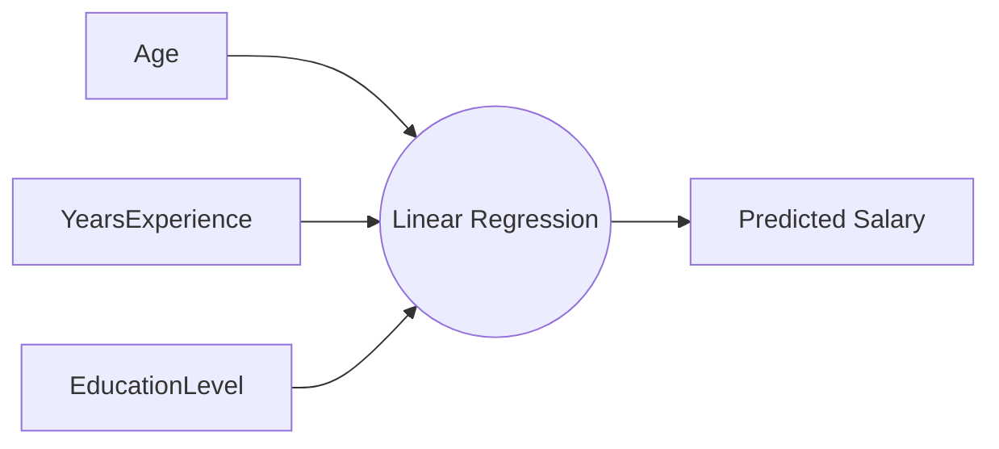

## Why is Linear Regression Important?

1. **Introduces the fundamentals of machine learning** — helps beginners understand features, targets, training, prediction, and evaluation.
2. **Is highly interpretable** — model coefficients can help explain how changes in input variables are associated with changes in the predicted target.
3. **Provides a strong baseline** — before using complex algorithms, a simple linear model can establish a performance benchmark.
4. **Is computationally efficient** — generally fast to train and easy to experiment with.
5. **Works well when relationships are approximately linear** — if the target changes in a reasonably linear manner with the predictors, Linear Regression can be effective.

---

## 📊 Diagram: Linear Regression Fit

The model attempts to find a line that best represents the relationship
between observations. The objective is **not** to pass through every
observation — instead, it finds a line that minimizes overall
prediction error.

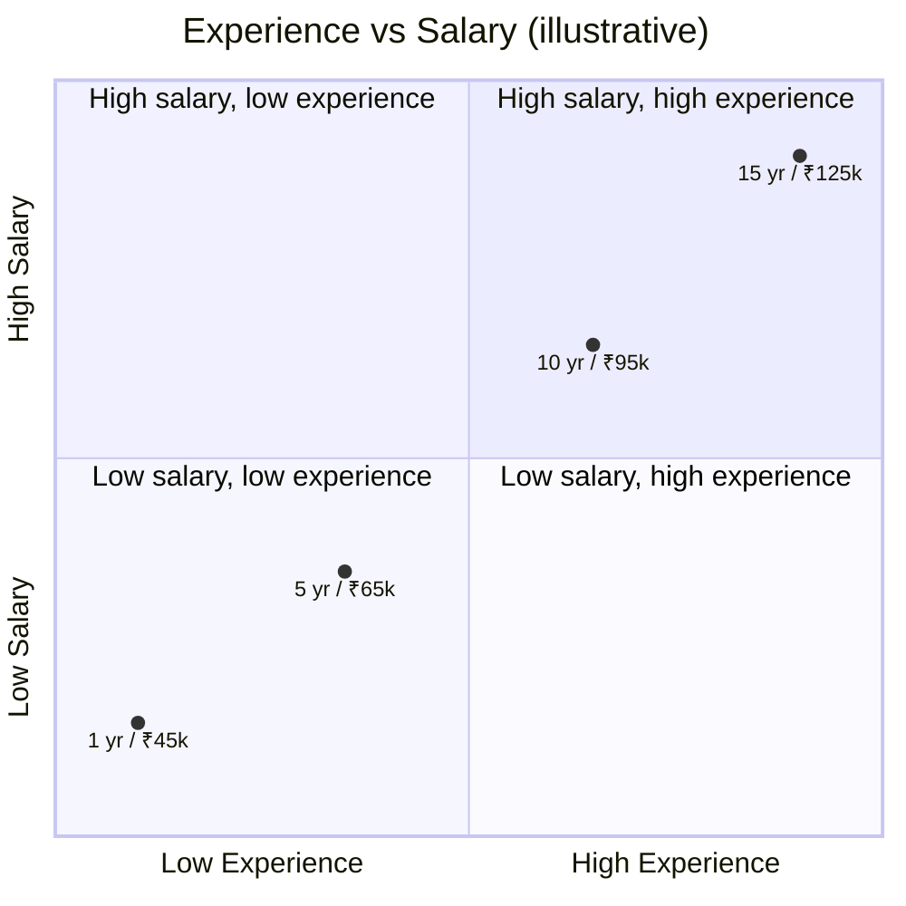

### Example

| Years of Experience | Salary   |
| -------------------- | -------- |
| 1 year                | ₹45,000  |
| 5 years               | ₹65,000  |
| 10 years              | ₹95,000  |
| 15 years              | ₹125,000 |

A linear model learns the general relationship and can then estimate the
salary for a new experience value.

---

# 2. Project Overview

This project uses a salary dataset containing **2,000 records and 4
columns** before duplicate removal.

| Column            | Type               | Description                       |
| ----------------- | ------------------ | ---------------------------------- |
| `Age`              | Integer             | Employee age                       |
| `YearsExperience`  | Integer             | Years of professional experience   |
| `EducationLevel`   | Object/Categorical  | Education category                 |
| `Salary`           | Integer             | Salary to be predicted             |

The notebook identifies `Salary` as the prediction target and uses the
remaining columns as model inputs.

---

# 3. Problem Statement

## Business Problem

Organizations often need to estimate appropriate salary levels based on
employee characteristics such as experience, age, and education.

A machine learning model can learn patterns from historical salary data
and use those patterns to estimate salary for new observations.

## Machine Learning Problem

This project formulates salary prediction as a **supervised regression
problem**.

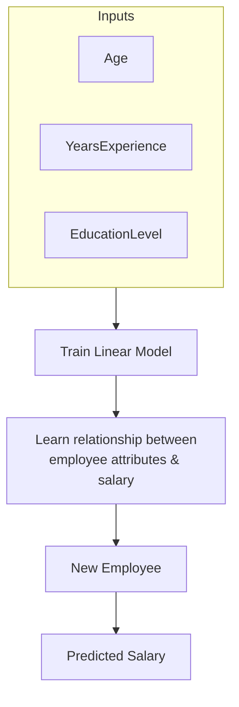

---

# 4. About the Dataset

The notebook loads the dataset using:

```python
df = pd.read_csv('Salary.csv')
```

## Dataset Size

| Stage                | Rows  | Columns |
| --------------------- | ----- | ------- |
| Initial                | 2,000 | 4       |
| After duplicate removal | 1,999 | 4       |

The notebook therefore removed **one duplicate record**.

## Data Types

- **3 integer columns:** `Age`, `YearsExperience`, `Salary`
- **1 object/categorical column:** `EducationLevel`

## Missing Values

```python
df.isnull().sum()
```

The recorded result shows **zero missing values** in all four columns.

## Descriptive Statistics

| Statistic | Age    | YearsExperience | Salary       |
| --------- | ------ | ---------------- | ------------ |
| Mean       | 41.077 | 12.942            | 102,088.6485 |
| Minimum    | 21     | 0                 | 29,100       |
| Median     | 41     | 11                | 96,387       |
| Maximum    | 60     | 39                | 221,269      |

These statistics provide an initial understanding of the distribution
and range of the numerical variables.

---

# 5. Machine Learning Workflow

The overall workflow followed in the notebook is:

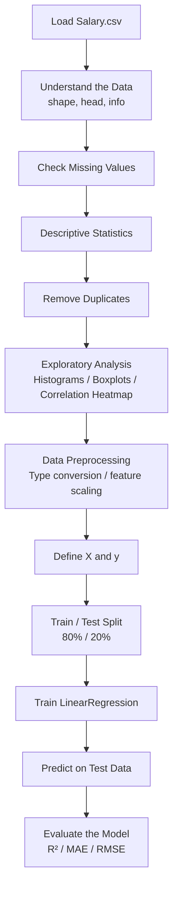

---

# 6. Step-by-Step Process

## Step 1 — Import Libraries

```python
import numpy as np
import pandas as pd
import seaborn as sns
import matplotlib.pyplot as plt
import warnings
```

| Library      | Purpose                                            |
| ------------ | --------------------------------------------------- |
| NumPy        | Numerical operations                                |
| Pandas       | Data loading and manipulation                       |
| Seaborn      | Statistical visualization                           |
| Matplotlib   | Plotting                                            |
| Scikit-learn | Preprocessing, splitting, modeling, and evaluation  |

Warnings are suppressed in the notebook using:

```python
warnings.filterwarnings('ignore')
```

## Step 2 — Load the Dataset

```python
df = pd.read_csv('Salary.csv')
```

A DataFrame allows the dataset to be inspected, cleaned, transformed,
and prepared for machine learning.

## Step 3 — Understand the Dataset

**Check shape:**

```python
df.shape
# (2000, 4)
```

**Inspect the first records:**

```python
df.head()
```

**Inspect data types:**

```python
df.info()
```

This shows that `EducationLevel` is categorical while the other three
columns are numerical.

## Step 4 — Check Missing Values

```python
df.isnull().sum()
```

Result:

```
Age                0
YearsExperience    0
EducationLevel     0
Salary             0
```

No missing-value treatment is required for the observed dataset.

## Step 5 — Descriptive Statistics

```python
df.describe()
```

This provides count, mean, standard deviation, minimum, quartiles, and
maximum — an important EDA step for identifying unusual ranges and
understanding the numerical variables before modeling.

## Step 6 — Remove Duplicate Records

```python
df.drop_duplicates(inplace=True)
```

The dataset changes from **2,000 rows → 1,999 rows**, indicating that
one duplicate row was removed.

> **Why remove duplicates?**
> Duplicate observations can give repeated records disproportionate
> influence during model training.

---

# 7. Exploratory Data Analysis

EDA helps us understand the data before asking a machine learning
algorithm to learn from it.

## 7.1 Histograms

The notebook generates histograms with KDE for `['Age', 'YearsExperience', 'Salary']`.

A histogram helps answer:
- How are values distributed?
- Is the distribution symmetric?
- Are there unusual values?
- Where are most observations concentrated?

## 7.2 Boxplots

The notebook also creates boxplots for the numerical variables, which
help identify the median, quartiles, spread, and potential outliers.

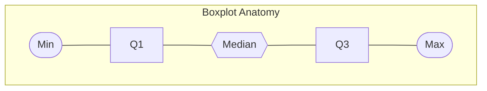

## 7.3 Correlation Heatmap

```python
df.corr(numeric_only=True)
```

```python
sns.heatmap(...)
```

Correlation helps measure the strength and direction of a linear
association between numerical variables — useful for investigating
whether `YearsExperience` and `Age` have meaningful linear relationships
with `Salary`.

> **Important:** Correlation does not prove causation.

---

# 8. Data Preprocessing

Before training a machine learning model, raw data often needs to be
converted into a form that the algorithm can process.

## 8.1 Data Type Conversion

The notebook contains:

```python
df = df.astype(int)
```

⚠️ **Implementation issue:** `EducationLevel` is an `object`/categorical
column containing values such as `Master` and `Bachelor`. A direct
`df.astype(int)` cannot convert these strings into integers.

**Recommended approach:**

```python
df = pd.get_dummies(df, columns=['EducationLevel'], drop_first=True)
```

The exact encoding strategy should be selected according to the
modeling objective.

## 8.2 Feature Scaling

The notebook applies `StandardScaler` to `['Age', 'YearsExperience']`:

```python
scaler = StandardScaler()
df[cols] = scaler.fit_transform(df[cols])
```

Standardization transforms a numerical variable as:

```
z = (x - mean) / standard deviation
```

After scaling, the transformed features are centered around zero with a
standard deviation close to one — this can make numerical features
comparable in magnitude.

---

# 9. Feature and Target Selection

```python
x = df.drop('Salary', axis=1)
y = df['Salary']
```

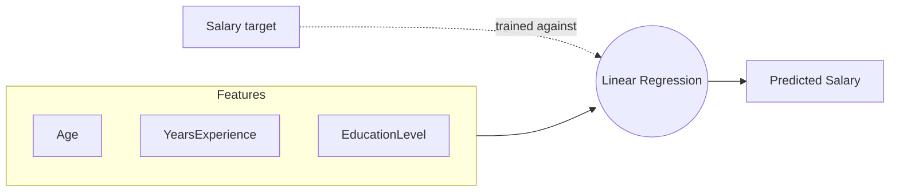

---

# 10. Train-Test Split

```python
train_test_split(x, y, test_size=0.20, random_state=42)
```

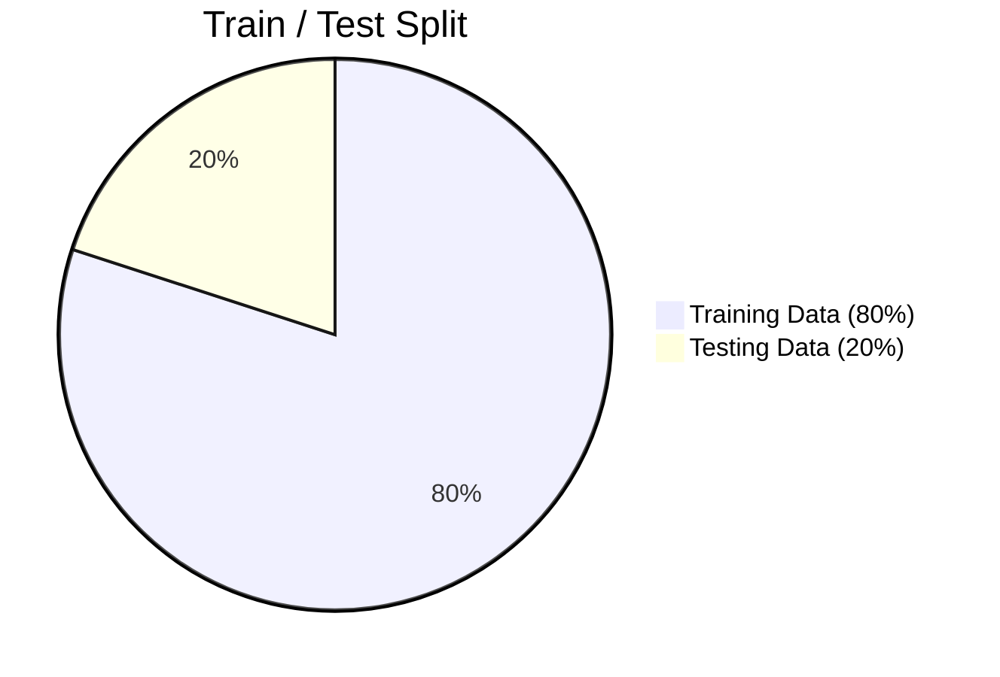

### Why split the data?

If we evaluate a model using the same observations used for training,
the evaluation may be overly optimistic. The test set acts as unseen
data and provides a better estimate of how the model performs on new
observations. `random_state=42` makes the split reproducible.

---

# 11. Training the Linear Regression Model

```python
from sklearn.linear_model import LinearRegression

model = LinearRegression()
model.fit(x_train, y_train)
```

During training, Linear Regression estimates coefficients that minimize
the overall squared prediction error.

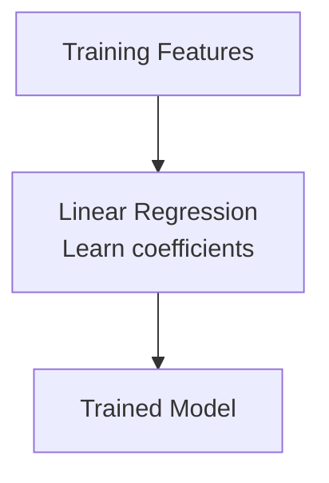

---

# 12. Prediction

```python
y_pred = model.predict(x_test)
```

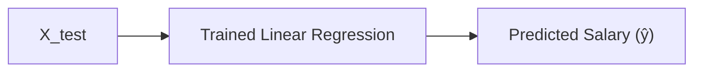

The actual salary is represented by `y_test`. The difference between
actual and predicted values is the **residual/error**:

```
Residual = Actual Salary - Predicted Salary
```

---

# 13. Understanding the Regression Line

For a simple one-feature example, the model finds a line that produces
predictions as close as possible to the observed values. For multiple
features, the idea extends from a line to a higher-dimensional linear
relationship.

### Example

| Attribute        | Value      |
| ----------------- | ---------- |
| Age                | 30         |
| YearsExperience    | 5          |
| EducationLevel     | Bachelor   |

The trained model uses the encoded and processed feature values to
calculate a predicted salary for this new employee.

---

# 14. Model Evaluation

The notebook evaluates the model using three metrics: **R² Score**,
**MAE**, and **RMSE**.

## 14.1 R² Score

R² measures how much of the variation in the target is explained by the
model relative to a baseline mean prediction.

- Closer to `1` → stronger fit
- Around `0` → little improvement over the mean baseline
- Negative → worse than the mean baseline

The notebook obtained **R² = 0.9877** — a very high test-set R².

## 14.2 Mean Absolute Error (MAE)

```
MAE = average(|actual - predicted|)
```

The notebook obtained **MAE = 3,858.09** — in salary units, the model's
average absolute prediction error on the recorded test results was
approximately 3,858 salary units. MAE is easy to interpret because it
remains in the same unit as the target.

## 14.3 Root Mean Squared Error (RMSE)

```
RMSE = √(average((actual - predicted)²))
```

The notebook obtained **RMSE = 4,451.28**. RMSE penalizes larger errors
more strongly than MAE.

---

# 15. Results

| Metric        | Result       |
| -------------- | ------------ |
| **R² Score**    | **0.987669** |
| **MAE**         | **3858.09**  |
| **RMSE**        | **4451.28**  |

### Interpretation

The model achieved a very strong fit on the recorded test split, with an
R² of approximately **0.988**. The MAE and RMSE indicate that prediction
errors were on the order of a few thousand salary units.

> **Important:** These results should not automatically be interpreted
> as evidence that the model will perform equally well in production.
> Data preprocessing issues and potential leakage must be addressed
> before using the performance as a final benchmark.

---

# 16. Important Implementation Notes

As a senior data-science review, there are a few issues in the current
notebook that should be addressed.

## 16.1 `EducationLevel` Needs Explicit Encoding

The dataset contains categorical values such as `Master` and `Bachelor`,
but the notebook later uses `df = df.astype(int)`. A categorical
encoding step should be added explicitly, for example:

```python
df = pd.get_dummies(
    df,
    columns=['EducationLevel'],
    drop_first=True
)
```

The exact encoding strategy should be selected according to the
modeling objective.

## 16.2 Avoid Data Leakage During Scaling

The notebook performs `scaler.fit_transform(df[cols])` **before** the
train-test split. For a rigorous machine learning workflow, the scaler
should be **fit only on training data** and then used to transform the
test data.

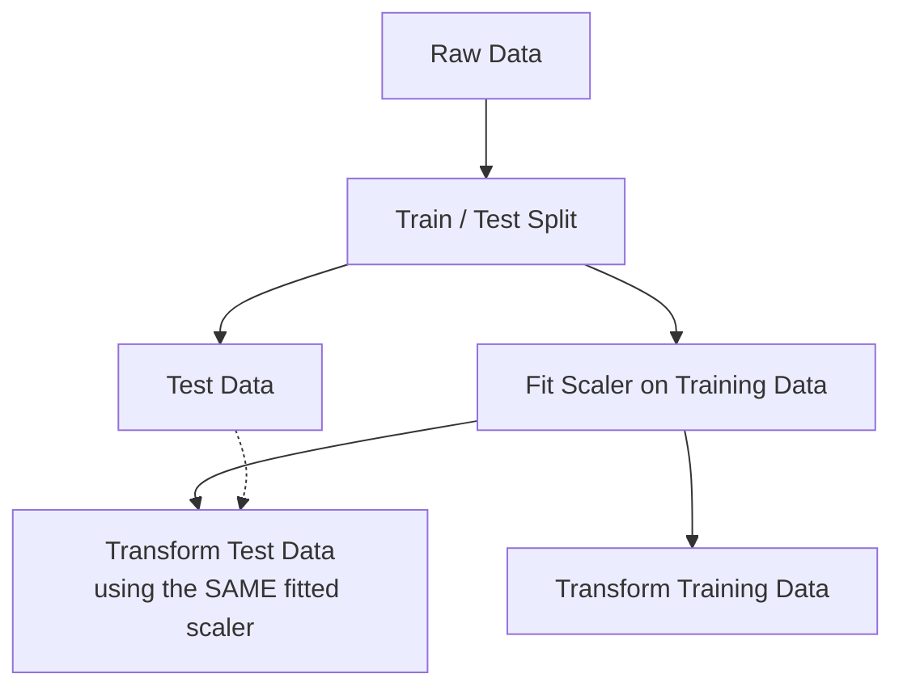

An even cleaner approach is to use a `Pipeline` and `ColumnTransformer`.

## 16.3 Metric Imports Should Be Explicit

```python
from sklearn.metrics import (
    r2_score,
    mean_absolute_error,
    mean_squared_error
)
```

Explicit imports improve reproducibility and make the notebook easier
for other developers to run.

## 16.4 Scaling Is Not Necessarily Required for Ordinary Linear Regression

For ordinary `LinearRegression`, feature scaling is generally **not
required for the mathematical solution itself**. Scaling can still be
useful for consistent preprocessing and for workflows involving other
algorithms, but it should have a clear purpose.

---

# 17. Recommended Production-Style Pipeline

A cleaner version of this project would follow:

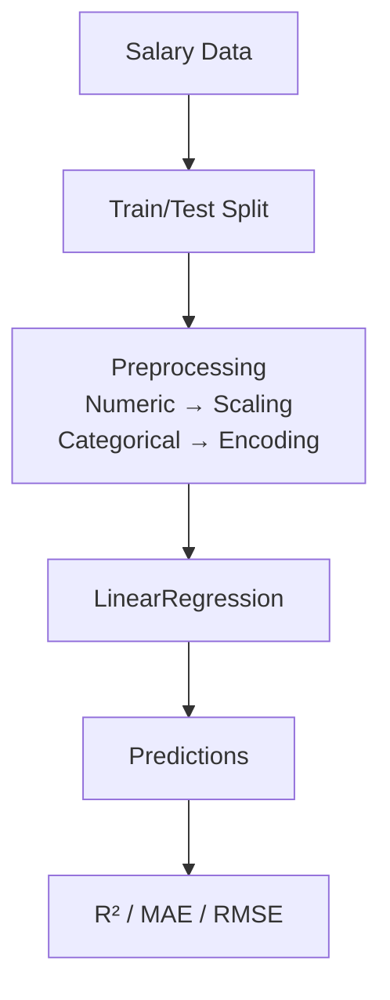

A `Pipeline` is particularly useful because it keeps preprocessing and
model training together and reduces the risk of applying
transformations incorrectly.

---

# 18. Project Structure

```
salary-prediction/
│
├── Salary.csv
├── salary_prediction_for_MLbeginners.ipynb
├── README.md
└── requirements.txt
```

---

# 19. Technologies Used

**Programming Language:** Python

**Libraries:** NumPy · Pandas · Matplotlib · Seaborn · Scikit-learn

**Machine Learning:** Linear Regression · Train-Test Split ·
Standardization · Regression Evaluation

**Evaluation Metrics:** R² Score · Mean Absolute Error · Root Mean
Squared Error

---

# 20. How to Run the Project

## 1. Clone the Repository

```bash
git clone <your-repository-url>
cd salary-prediction
```

## 2. Install Dependencies

```bash
pip install numpy pandas matplotlib seaborn scikit-learn jupyter
```

## 3. Start Jupyter Notebook

```bash
jupyter notebook
```

## 4. Open the Notebook

Open `salary_prediction_for_MLbeginners.ipynb`. Make sure `Salary.csv`
is located in the expected working directory.

---

# 21. Future Improvements

- Explicitly encoding `EducationLevel`
- Moving preprocessing after the train-test split
- Using `ColumnTransformer` and `Pipeline`
- Performing cross-validation
- Comparing Linear Regression with Ridge and Lasso
- Testing tree-based regression algorithms
- Performing residual analysis
- Checking multicollinearity
- Adding prediction-vs-actual plots
- Saving the trained model with `joblib`
- Creating a Streamlit interface for interactive salary prediction
- Adding unit tests and reproducible dependency management

---

# 22. Key Takeaways

This project demonstrates the fundamental machine learning workflow:

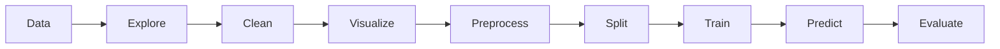

The most important lesson is that **building a machine learning model is
not only about calling `.fit()`**. Reliable modeling requires
understanding the data, selecting appropriate features, handling
categorical variables correctly, preventing data leakage, and
evaluating performance on unseen data.

---

## ⭐ Final Summary

This project uses **Linear Regression to predict salary** from
employee-related attributes. The dataset contains 2,000 initial records
and four variables: `Age`, `YearsExperience`, `EducationLevel`, and
`Salary`. The notebook performs exploratory data analysis, removes one
duplicate record, applies preprocessing, splits the data into training
and testing sets, trains a Linear Regression model, generates
predictions, and evaluates the model.

| Metric | Result       |
| ------ | ------------ |
| R²     | 0.987669     |
| MAE    | 3858.09      |
| RMSE   | 4451.28      |

These results are promising, but the current implementation should
first be cleaned up — particularly the categorical encoding and
preprocessing workflow — before the model is considered
production-ready.
